# i2DTO 数据同步

## 同步规则配置

### 新建同步规则_基本设置

点击"数据同步_同步规则_新建同步规则"，进入同步规则的基本配置页面：

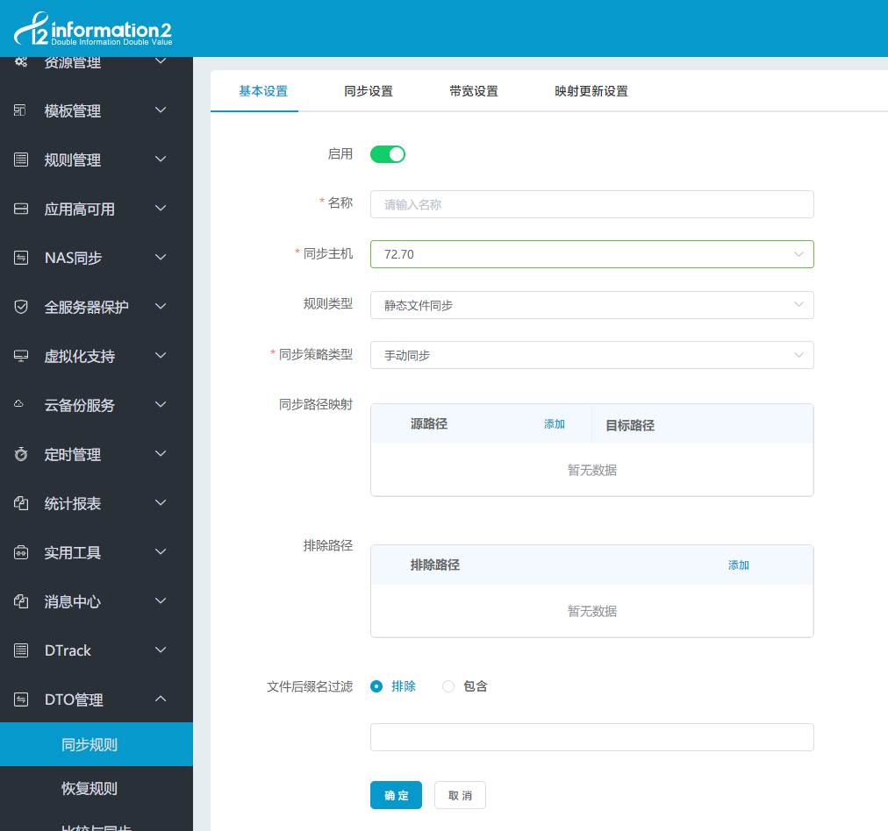

1. 启用：不勾选的话不能使用该规则。

2. 名称：任意指定，便于管理即可。

3. 同步主机：下拉框中会列出"数据同步_同步主机"中已有同步主机供选用；

4. 规则类型：静态文件同步/动态文件同步；

    1. 静态文件同步：**每次启动规则时会扫描源路径下的所有文件。首次同步时， 会同步源路径下的所有文件。**

5. 同步策略类型：手动同步/定期同步/间隔同步；

    1. 手动同步：需要手动启动规则；

    2. 定期同步：可指定每个月的某几天或者每个星期的某几天中的某几个时间点开始同步，规则会在设置的时间自动开始运行；

        **注：特殊情况，当设置的时间在当前时间之前，且与当前的日期和小时数相同， 那么提交规则之后会立即自动启动一次。比如规则设置为每周二（每月 26 号）14:00，现在是周二（26 号）14:10，那么现在提交规则后会立即自动启动一次。**

        当同步策略类型为“定期同步”时，出现“定期同步策略”配置项：

        

        点击"添加"，出现选择日期的界面，可以选择每周/月：

        

        点击"确定"：

        

        可以再次点击"添加":

        

        意思是：每周的周日、周五的 7:00,12:00 以及每月的 17 号的 8:00 点规则自动开启运行；

    3. 间隔同步：可指定从某个时间点开始每间隔多久自动启动一次规则，最小间隔时间为 1 分钟，规则会在设置的时间自动开始运行。

        **注：若时间点在当前时间之前，那么提交规则之后会立即自动启动；若时间是未来的时间，那么提交规则后不会立即自动启动，会等到未来的时间点再启动。**

        当同步策略类型为"间隔同步"时，出现"间隔同步策略"配置项：

        

        可以点击"开始时间"后的按钮选择其他时间点，示例的意思是：从 2019 年 5 月 23 日 16:30:33 开始，每间隔 5 分钟规则自动开启运行。

6. 同步路径映射：将源路径下的数据备份到目标路径上。

    1. 源路径：本地存储上需要同步的数据路径：

        

        点击上图中的"添加"按钮，会弹出源路径的目录选择框，显示同步主机上的所有磁盘目录以供选择：

        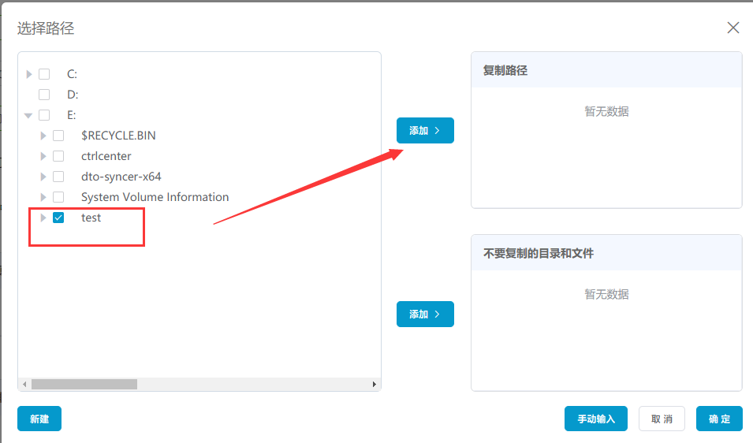

        选择好之后点击上图中间的蓝色按钮，完成源路径的选择，支持多选：

        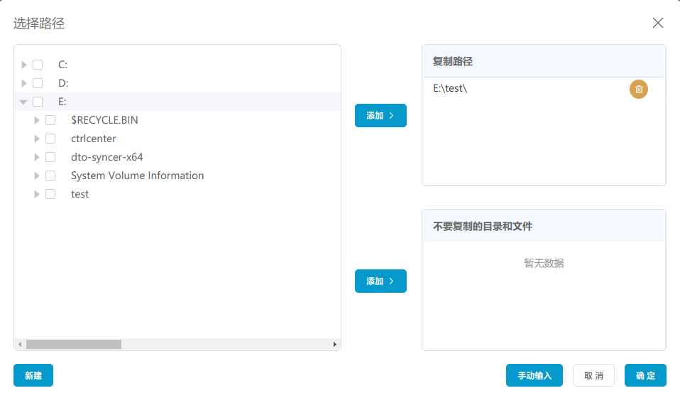

        也可以选择上图右下角的"手工输入"，此时弹出编辑框，可以进行手工输入、修改路径，路径最后须以分隔符\\结束，如果是多个路径则须以英文的逗号隔开，如这样（Y:\\as\\,Z:\\as\\,Z:\\bigfile\\,Z:\\压力\\）：

        

        点击"确定"后，添加好的源路径如下：

        

        3.0-2000 版本开始源路径配置支持通配符：

        

        ```
        [[yyyy]]: 实际同步时用，运行当时的年代替，比如：2018

        [[mm]]: 实际同步时用，运行当时的月份代替，比如：01,10,12

        [[m]]: 实际同步时用，运行当时的月代替，对小于 10 的月份，前面不加 0，比如：1,2,10,11,12

        [[dd]]: 实际同步时用，运行当时的日代替，比如：01,10,31

        [[d]]: 实际同步时用，运行当时的日代替，对小于 10 的天，前面不加 0，比如：1,2,10,31
        ```

    2. 目标路径：需要备份到该规则指定的同步主机所关联的存储上的路径；

        

        点击上图所示的"图标"添加源路径对应的目标路径，
        会弹出规则中指定的同步主机所关联的对象存储上的所有存储桶及其下的文件夹以供选择；

        也可手动编辑，如果目标是对象存储，则手工输入的路径中存储桶必须是已存在的，目录名可以不存在，在规则启动后同步数据时自动创建，格式必须是

        "存储桶名:/目录名/\[子目录名/\]"；目标路径一次只允许选择或手工输入一个:

        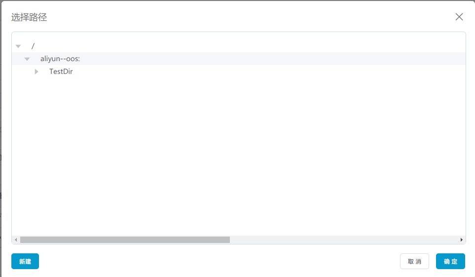

        点击上图中"确定"按钮后即可。

7. 排除路径：源路径中不需要同步的目录，必须为源路径的子目录。

8. 后缀名过滤：以后缀名为过滤条件，格式为".文件扩展名"；若多个过滤条件则用逗号隔开，如：.txt,.doc,.rtf

    1. 排除：不同步源路径中该过滤项中定义的文件类型；

    2. 包含：只同步源路径中该过滤项中定义的文件类型。

### 新建同步规则_同步设置

"新建同步规则_同步设置"，进入同步规则的同步配置页面：

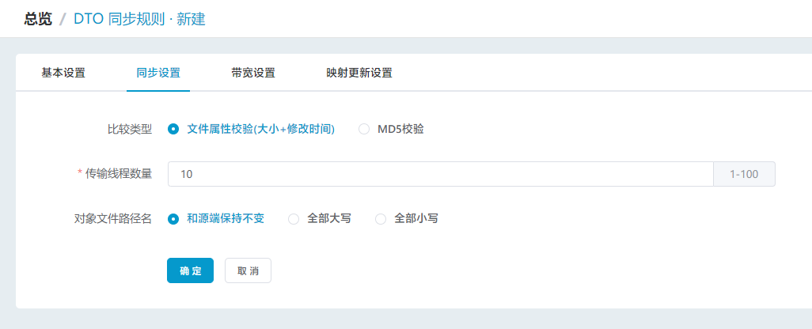

1. 比较类型： 重镜像时的校验方式

    1. 文件属性检验：通过文件大小和修改时间进行比较；

    2. MD5 校验：通过文件的 MD5 值进行比较。

    **注：i2dto 不对同步规则的目标端做扫描。重镜像时是当前扫描源文件时获取的文件属性/MD5 和上一次传输时的源文件属性/MD5 作比较（每次在文件同步成功后，会将从对象存储上返回的文件属性/MD5 记入数据库的 filemapping 表中）， 当比较结果不一致或缺失时，重镜像时就会传输该文件。但对象存储对分片上传的文件返回的 MD5 有可能为空也有可能是最后一个分片的 MD5，并非文件真正的 MD5，所以导致重镜像时源端并没有变化的分片文件可能会重传。**

2. 传输线程数量：可以根据需要指定 1-100 的线程个数

3. 对象文件路径名：

    1. 和源端保持不变：区分大小写，和源端大小写保持一致；

    2. 全部为大写（传输时转换）：在传输时，将对象存储上的桶名后的所有路径，包括目录名、子目录名、文件名、文件后缀名全部转换为大写；

    3. 全部为小写（传输时转换）：在传输时，将对象存储上的桶名后的所有路径，包括目录名、子目录名、文件名、文件后缀名全部转换为小写；

    注：重镜像时是本地和 mongodb 中的记录比对，所以转换大小写不影响比对。

### 新建同步规则_带宽设置

"新建同步规则_带宽设置"，进入同步规则的带宽设置页面：


1. 点击"添加"按钮，在带宽设置弹框中选择时间、填写带宽，点击"确定" 按钮即可：

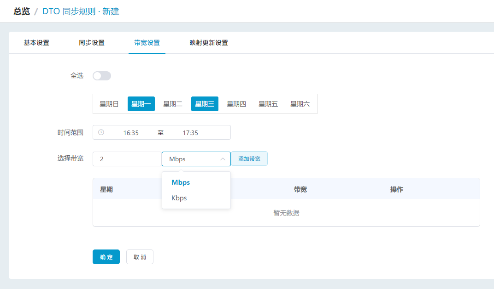

**注：支持 0 带宽，0 带宽时间范围内暂停比对和传输，扫描正常进行。**

### 新建同步规则_映射更新设置

"新建同步规则_映射更新设置"，进入同步规则的映射更新设置页面：

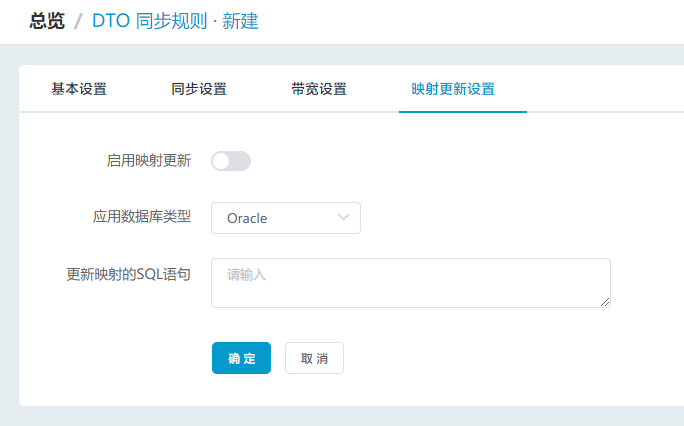

1. 启用更新映射：勾选则启用；通过数据库来映射数据迁移后文件的新路径。

2. 应用数据库类型：Oracle/SQLServer

    **注：支持 Oracle10g 及以上版本，sqlserver2005 及以上版本。**

    1. 开启映射更新，选用 oracle 数据库时：进入目录 dto-syncer-x64\\dto\\conf， 复制文件 Oracle.example.properties，并改名为 Oracle.properties（注意文件名的大小写必须正确）：

        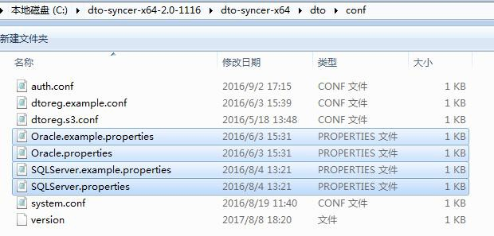

        然后根据实际环境修改文件中"ip\:端口号\:实例名"，以及用户名和密码：

        ```
        ORACLE_DB_DRIVER_CLASS=oracle.jdbc.driver.OracleDriver
        ORACLE_DB_URL=jdbc:oracle:thin:@192.168.86.38:1521:orcl
        ORACLE_DB_USERNAME=i2
        ORACLE_DB_PASSWORD=i2
        ORACLE_MinPoolSize=5
        ORACLE_MaxPoolSize=20
        ```

    2. 开启映射更新，选用 sqlserver 数据库时：进入目录 dto-syncer-x64\\dto\\conf， 复制文件 SQLServer.example.properties，并改名为 SQLServer.properties，然后根据

        实际环境修改文件中的"ip:端口号"，数据库名，用户名和密码：

        ```
        #This example for SQLServer 2008, if for other database type, URL may be different.

        SQLServer_DB_URL=jdbc:sqlserver://192.168.81.245:1433;DatabaseName=i2testdb
        SQLServer_DB_USERNAME=i2
        SQLServer_DB_PASSWORD=info2soft
        ```

    3. 更新映射的 SQL 语句：update test_table set destpath=? where srcpath=?

        （"test_table"是数据库中的表名；"destpath"是 test_table 表中存放映射更新后文件路径的字段；"srcpath"是 test_table 表中存放需要映射更新的文件路径的字段。根据实际环境修改这三个名称）

        如下图，在同步规则中启用映射更新，并加入更新映射的 sql 语句；

        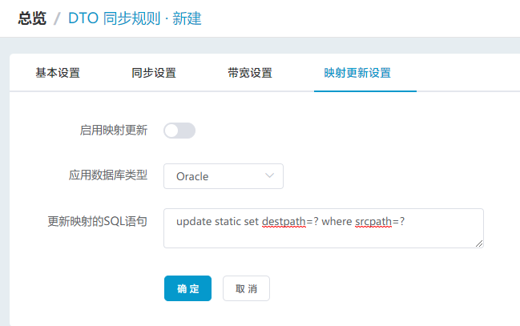

        开启规则（前提是源端路径已经插入到数据库 static 表的 srcpath 字段中），当数据同步到对象存储上的同时会把对象存储上的文件路径插入到 static 表中srcpath 对应的 destpath 字段中，见下图。

        

        

## 恢复规则配置

### 新建恢复规则_基本设置

点击"数据同步_恢复规则_新建恢复规则"，进入恢复规则的基本配置页面：


1. 启用：不勾选的话不能使用该规则。

2. 名称：任意指定，便于管理即可。

3. 同步主机：可以选择不同的同步主机，将不同存储上的数据恢复到生产机的共享存储或者同步主机的本地存储上。

4. 同步策略类型：配置和同步规则的同步策略类型相同，可参考 **[新建同步规则-基本设置](#新建同步规则_基本设置)** 的步骤 5.同步策略类型；

5. 源存储：选择要从哪个对象存储上恢复数据。

6. 同步路径映射：将源路径的数据恢复到目标路径上。

    1. 源路径：恢复规则配置中源存储上需要恢复的数据路径：

        

        点击上图中的"添加"按钮，会弹出源存储上所有目录以供选择：

        选择好之后，点击中间的蓝色按钮，完成源路径的选择：

        

        也可以选择上图右下角的"手工输入"，此时弹出输入框，可以进行手工输入、修改路径，手工输入的路径必须是已经存在的，此时如果是多个路径，那么每个路径最后须以分隔符/结束且必须以英文的逗号隔开，如下所示这样（yaom:/test/,yaom:/test1/,yaom:/shougong/）：

        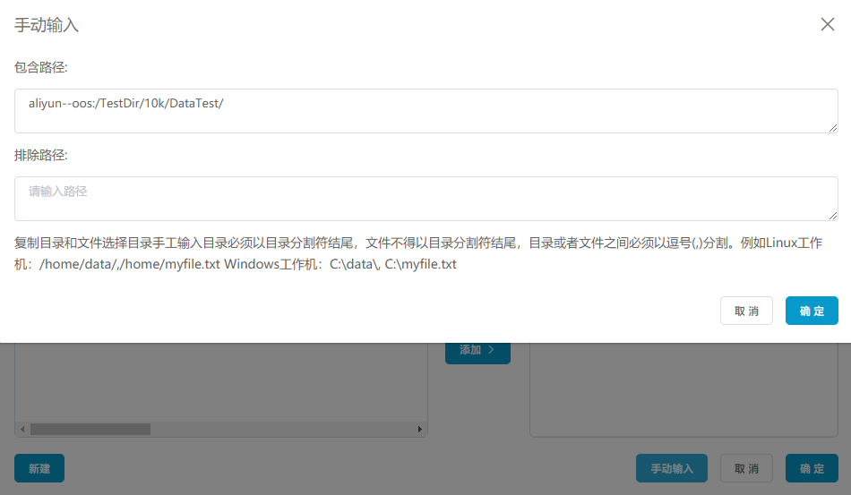

        然后点击上图的"确定"按钮，完成源路径的添加：

        

    2. 目标路径：恢复到同步主机本地存储的路径：

        

        点击上图所示的“点击添加目标路径”添加源路径对应的目标路径，会弹出
        同步主机本地存储上的所有目录，以供选择；也可以直接在路径框中手动编辑，
        手工输入的路径中盘符必须是已经存在的，目录名可以是不存在的，在恢复规则
        启动后下载数据时自动创建，格式必须是“盘符:\目录名\[子目录名\]”；目标路
        径一次只允许选择或手工输入一个：

        

        点击上图中"确定"按钮即可。

7. 排除路径：源路径中不需要恢复的目录。

8. 后缀名过滤：以后缀名为过滤条件，格式为".文件扩展名"；若多个过滤条件则用逗号隔开，如：.txt,.doc,.rtf

    1. 排除：不同步源路径中该过滤项中定义的文件类型；

    2. 包含：只同步源路径中该过滤项中定义的文件类型。

### 新建恢复规则_同步设置

"新建恢复规则_同步设置"，进入恢复规则的同步配置页面：

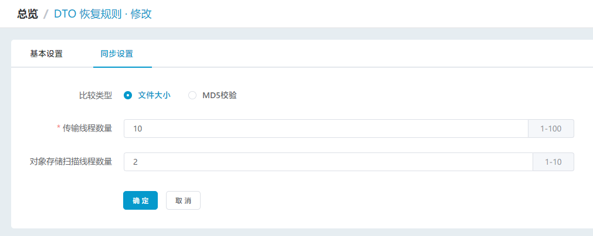

1. 比较类型：重镜像时的校验方式

    1. 文件大小：通过源、目标的文件大小进行比较；

    2. MD5 校验：通过源、目标的文件 MD5 进行比较。

2. 传输线程数量：可指定 1-100 的传输线程个数。一个线程处理一个目录。

3. 对象存储扫描线程数量：

## 比较和同步规则配置

### 新建比较规则_基本设置

点"数据同步_比较和同步_新建比较规则"，进入比较规则的基本配置页面：


1. 启用：不勾选的话不能使用该规则。

2. 名称：任意指定，便于管理即可。

3. 同步主机：下拉框会列出"数据同步_同步主机"中已有同步主机以供选用；

4. 规则类型：仅比较/比较与同步；

    1. 仅比较：仅比较两端一致性不做传输，给出相同、不相同、缺失以及总的文件数；详细可见 **[操作_查看比较结果](#比较与同步规则的主界面说明)**；

    2. 比较与同步：比较两端一致性的同时会传输不同和缺失的文件到目标端， 给出相同、不相同、缺失、传输、传输失败以及总的文件数；详细可见 **[操作_查看比较结果](#比较与同步规则的主界面说明)**；

5. 同步策略类型：配置和同步规则的同步策略类型相同，可参考 **[新建同步规则_基本设置](#新建同步规则_基本设置)** 的步骤 5.同步策略类型；

6. 源存储：下拉框会列出"数据同步_对象存储"中已有的存储以供选用；

7. 目标存储：下拉框会列出"数据同步_对象存储"中已有对象存储以供选用；

8. 同步路径映射：

    1. 源路径：源存储上的路径

        源路径可通过界面选择或手工输入，手工输入的路径必须是源存储上已经存在的。如果是 LocalFS 的话最后须以分隔符\\结束，多个路径的话须以英文的逗号隔开，如这样 Y:\\as\\,Z:\\压力\\；如果是对象存储的话路径最后须以分隔符/结束，多个路径的话须以英文的逗号隔开，如这样 yaom:/test/,yaom:/test1/

        3.0-2000 版本开始源路径配置支持通配符：

        

        ```
        [[yyyy]]: 实际同步时用，运行当时的年代替，比如：2018

        [[mm]]: 实际同步时用，运行当时的月份代替，比如：01,10,12

        [[m]]: 实际同步时用，运行当时的月代替，对小于 10 的月份，前面不加 0，比如：1,2,10,11,12

        [[dd]]: 实际同步时用，运行当时的日代替，比如：01,10,31

        [[d]]: 实际同步时用，运行当时的日代替，对小于 10 的天，前面不加 0，比如：1,2,10,31
        ```

    2. 目标路径：目标存储上的路径

        目标路径可通过界面选择或手工输入，手工输入的路径中存储桶必须是已经存在的，目录可以不存在在规则启动同步数据时自动创建，路径最后须以分隔符

        /结束，多个路径的话须以英文的逗号隔开，如这样 yaom:/test/,yaom:/test1/

9. 排除路径：源路径中不需要同步的目录。

10. 后缀名过滤：以后缀名为过滤条件，格式为".文件扩展名"；若多个过滤条件则用逗号隔开，如：.txt,.doc,.rtf

    1. 排除：不同步源路径中该过滤项中定义的文件类型；

    2. 包含：只同步源路径中该过滤项中定义的文件类型。

### 新建比较规则_比较设置

"新建比较规则_比较设置"，进入比较规则的比较配置页面：

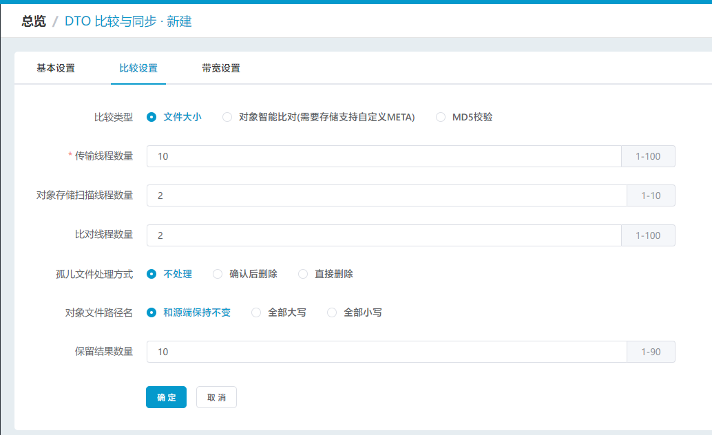

1. 比较类型： 重镜像时的校验方式

    1. 文件大小：通过源、目标文件的大小进行比较；

    2. 对象智能比对：提交规则时会判断备端存储是否支持自定义 META，不支持则不允许规则提交。智能比对过程如下：

        1.  本地计算文件大小和修改时间(a)；

        2.  对象存储上获取文件大小和 META 中记录的修改时间（META 中记录上一次传输完成时源端文件的 MTIME）(b)；

        a 和 b 如果一致，则文件相同；如果不一致，则不同。

    3. MD5 校验：通过源、目标文件的 MD5 值进行比较（本地需计算 md5，对象存储直接采用Etag，对象存储将收到文件的 MD5 值放在返回结果的ETag 中）；

        **注：对象存储返回分片上传文件的 MD5 有可能为空或是最后一个分片的 MD5， 因此对象存储的 MD5 并不完全可靠。"文件大小" 比对最快；
        当文件较大时"对象智能比对"比"MD5 校验"快（大文件本地计算 md5 很慢）；
        当文件较小时"MD5 校验"比"对象智能比对" 快（对象存储的文件修改时间需从 META 中获取，一个文件就是一次请求）。**

2. 对象存储扫描线程数量：可根据需要指定 1-10 个线程数；

3. 对比线程数量：可根据需要指定 1-100 个线程数；

4. 传输线程数量：可根据需要指定 1-100 个线程数；

5. 孤儿文件处理方式：

    1. 不做处理：不删除孤儿文件，存在在目标端；

    2. 直接删除：将孤儿文件自动从目标端删除；

    3. 确认后删除：将孤儿文件计入孤儿文件列表，可通过规则主界面的"查看孤儿文件"按钮来查看，以及选择是否要将目标端的孤儿文件删除。

    **注：定期同步或间隔同步策略时不允许选择"确认后删除"，会提示："任务周期性运行，孤儿文件不能选择确认后删除"**

6. 对象文件路径名：

    1. 和源端保持不变：区分大小写，和源端大小写保持一致；

    2. 全部为大写（传输时转换）：在传输时，将对象存储上的桶名后的所有路径，包括目录名、子目录名、文件名、文件后缀名全部转换为大写；

    3. 全部为小写（传输时转换）：在传输时，将对象存储上的桶名后的所有路径，包括目录名、子目录名、文件名、文件后缀名全部转换为小写；

    **注意：由于是分别扫描本地和对象存储中记录做比对，所以转换大小写会影响比对，发生转化的，比对时会认为两边不一致。**

7. 保留结果数量：设置"比较规则_查看比较结果"中保留的记录条数。

### 新建比较规则_带宽设置

"新建比较规则_带宽设置"，进入比较规则的带宽配置页面：

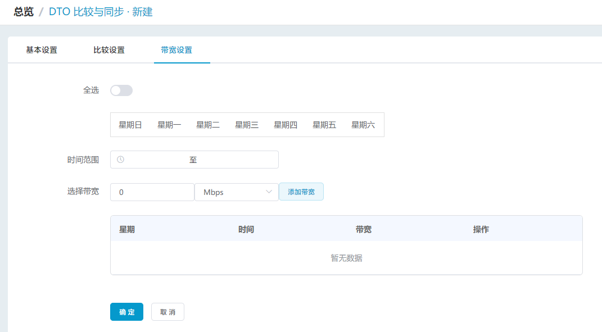

设置方法同同步规则的带宽设置，可参见 **[新建同步规则_带宽设置](#新建同步规则_带宽设置)** 。

**注：当本地和对象存储进行比对时支持 0 带宽，0 带宽时间范围内暂停比对和传输，扫描正常进行。**

## 界面上显示的各项信息说明

### 同步规则的主界面说明

同步规则主界面显示如下：


1. 名称、同步主机：显示同步规则的配置；

2. 启用：1 为启用状态；0 为不启用状态，该状态下规则不能使用。

3. 状态：

    1. 文件扫描：规则运行中，正在扫描源端的文件；

    2. 百分比：以百分比显示传输的进度，以字节计算而不是文件数量；

    3. 停止：手动停止规则；

    4. 完成：传输成功；

    5. 错误：传输失败；

    6. 未知：同步主机离线或者连不上导致规则未知状态。

4. 相同的文件数：静态文件同步中指：源路径下已经同步过且当前没发生变化的文件数；动态文件同步中指：源路径下当前捕获到的所有发生变化的文件所在的目录下的没有变化的文件总数。

5. 传输文件数：此次规则运行中成功传输的文件数；

6. 传输失败数：记录可能由于读文件失败、源端文件不断写入等原因导致的传输失败的文件数，此时规则状态为"错误"，点击"传输失败数"中的非零数字可查看失败的文件列表。当规则正在运行时是查看不到的。

7. 文件总数：静态文件同步中指：源路径下的文件总数；动态文件同步中指： 源路径下当前捕获到的所有发生变化的文件所在的目录下的文件总数。

8. 传输字节数：统计该规则本次传输的字节数，非该规则累积传输数据量。

9. 操作_从头开始：重新开始扫描源路径（静态规则）或变化文件列表（动态规则），然后同步变化了的文件；

10. 操作_继续同步：针对已经扫描完成但传输中断的规则，点击"继续同步" 可接着上次传输中断的地方开始传输文件，不需要再次做扫描操作；但扫描未完成时中断的规则，即使点"继续同步"也会重新开始扫描，相当于"从头开始"。

11. 操作_停止规则：手动停止正在运行中的规则；

12. 操作_查看流量图：可以查看实时流量图/日流量图/月流量图。

13. 操作_修改配置：修改同步规则配置，规则正在运行时不允许修改提交；

14. 操作_删除：删除该规则，正在运行的规则不允许删除。

### 恢复规则的主界面说明

恢复规则主界面显示如下：


1. 名称、同步主机：显示恢复规则的配置；

2. 启用：1 为启用状态；0 为不启用状态，该状态下规则不能使用。

3. 状态：

    1. 文件扫描：规则运行中，正在扫描源端的文件；

    2. 百分比：以百分比显示传输的进度，以字节计算而不是文件数量；

    3. 停止：手动停止规则；

    4. 完成：传输完成；

    5. 未知：同步主机离线或者连不上导致规则未知状态。

4. 相同的文件数：源路径下已经传输过且当前没有发生变化的文件数；

5. 传输文件数：此次规则运行中成功传输的文件数；

6. 传输失败数：记录可能由于读文件失败等原因导致的传输失败的文件数，此时规则状态为"错误"，点击"传输失败数"中的非零数字可查看失败的文件列表。当规则正在运行状态时是查看不到的。

7. 文件总数：源路径下的文件总数；

8. 操作_从头开始：重新开始扫描规则中的源路径，恢复文件到目标端路径；

9. 操作_暂停：手动暂停正在运行中的规则；

10. 操作_修改配置：修改同步规则的配置，规则正在运行时不允许修改提交；

11. 操作_删除：删除规则，正在运行的规则不允许删除。

### 比较与同步规则的主界面说明

比较规则主界面显示如下：


1. 名称、同步主机：显示同步规则的配置；

2. 启用：1 为启用状态；0 为不启用状态，该状态下规则不能使用。

3. 状态：

    1. 文件扫描：规则运行中正在扫描源端文件，边扫描边比较的；

    2. xx.xx%：扫描已完成，比较进度=（相同文件数+不同文件数+缺失文件数）/文件总数；

    3. 停止：手动停止规则；

    4. 完成：比较或比较同步完成；

    5. 错误：有文件传输失败；

    6. 未知：同步主机离线或者连不上导致规则未知状态。

4. 相同的文件数：源路径和目标路径下相同的文件数量；

5. 不同文件数：源路径和目标路径下都存在但不相同的文件数量；

6. 缺失文件数：源路径下有而目标路径下没有的文件数量；

7. 文件总数：源路径下本次扫描到的文件总数；

8. 传输文件数：统计该规则本次运行传输的文件数量；

9. 总字节数：扫描到的该规则源路径下的总字节数；

10. 操作_从头开始：重新开始扫描源路径和目标路径；

11. 操作_继续：针对已经扫描完成的规则，点击"继续"可以接着上次中断的地方开始比较或传输文件，不需要再次做扫描操作；但扫描未完成时中断的规则， 即使点"继续同步"也会重新开始扫描，相当于"从头开始"；

12. 操作_暂停：手动停止正在运行中的规则；

13. 操作_查看孤儿文件：当孤儿文件处理方式为"确认后删除"时，可以在此查看孤儿文件列表及选择是否将目标端对应文件删除。

14. 操作_查看比较结果：查看比较结果的详细信息：

    1. 比较结果列表：

        

    2. 比较结果列表_操作_查看比较结果：比较结果列表中最近的一条的比较结果概览中，当有不同文件和缺失文件时，可以点击其后对应的"查看详情"查看具体文件：

        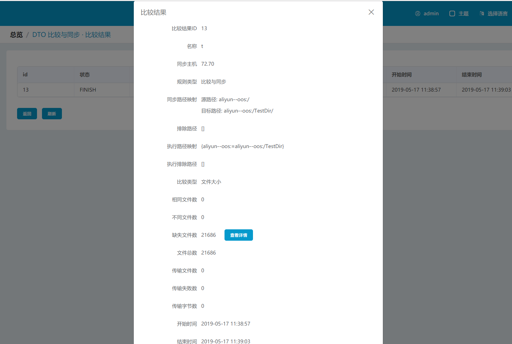

15. 操作_查看流量图：可以查看实时流量图/日流量图/月流量图；

16. 操作_修改配置：修改比较规则配置，规则正在运行时不允许修改提交；

17. 操作_删除：删除该规则，正在运行的规则不允许删除。

## 使用注意事项

1. i2DTO 的同步规则只扫描源路径，不会去扫描目标路径，所以当删除了目标端文件，只要源端文件没有变化，再次启动同步规则也是不会再次传输的。比较和同步规则是会同时扫描源备端路径的，不一致就会做传输。

2. 不断变化的文件同步有时可能会出现"错误"的状态，可在"传输失败数" 中查看失败的文件列表，等文件不再变化时再次开启规则，能保证两端数据一致。

3. 重启同步主机 syncer 进程后，规则不用重新提交使其生效，程序会自动加载。

4. 同步主机日志位置：在同步机安装包的\\dto\\logs\\目录下；

5. 单个文件大小大于\[分片大小\*5\]之后，才会进行分片上传。
